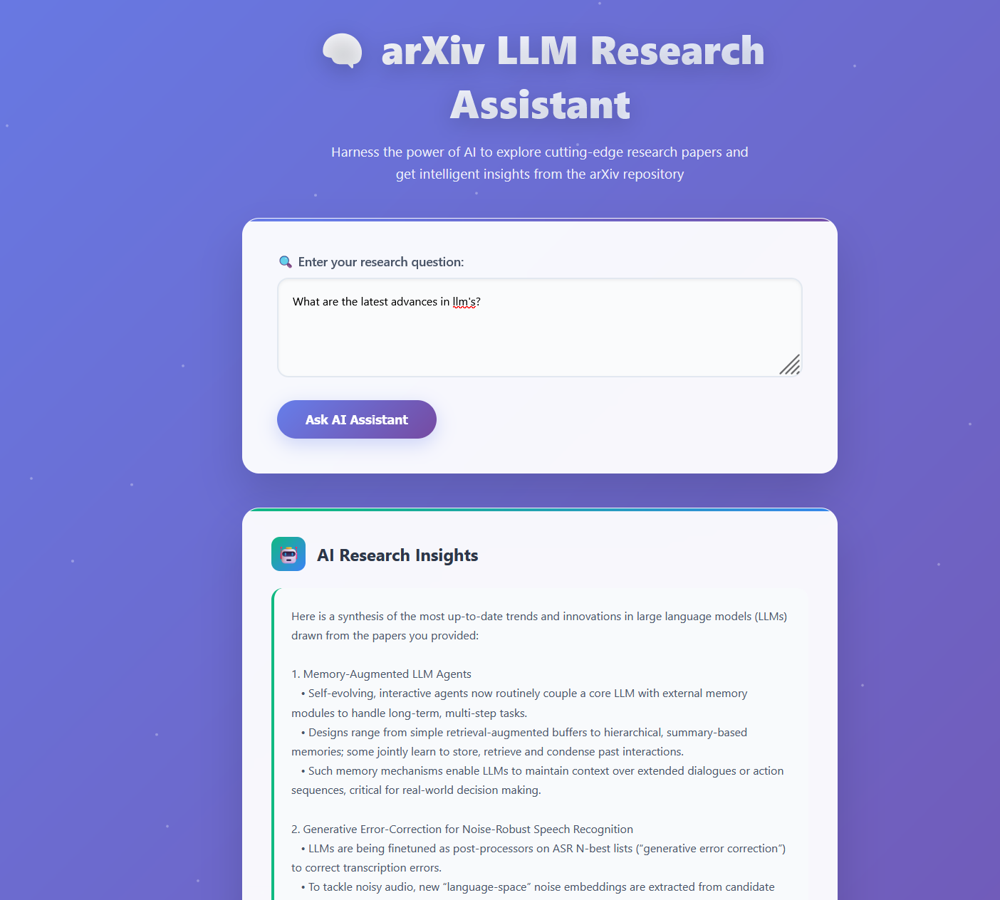

# arXiv LLM Research Assistant

A web-based research assistant that combines **semantic search**, **LLMs**, and **arXiv papers** to help you quickly explore cutting-edge research.

Built using:
- Elasticsearch for vector-based paper retrieval
- OpenAI GPT for summarization
- Flask for backend and React for frontend
- Google BigQuery for scalable scientific data ingestion

---

## What It Does

- Accepts a **natural language research question** (e.g. _"What are the latest methods for fine-tuning LLMs on small datasets?"_)
- Searches relevant arXiv papers using keyword relevance
- Builds a contextual prompt from summaries of the top papers
- Uses GPT-4 to generate a high-quality, concise answer
- Displays **citations** to the papers used in the answer

---

## Demo Screenshot

 


## Getting Started

### Docker
The easiest way of running the application is using docker

```
docker compose build
docker compose up -d
```

Then we have to ingest the data, for the time being I do
```
docker compose exec backend python modules/ingest_data.py
```

Then we can already open the ```http://localhost``` url in the web browser and start interacting with the application.

## Development
For user tests and development, it is better to run the Flask app by steps
### 1. Prerequisites

- Python 3.11
- A running instance of Elasticsearch
- OpenAI API key
- Google Cloud credentials for BigQuery access (optional if using sample data)

---

### 2. Install Requirements

```bash
pip install -r requirements.txt
```

### 3. Create an .env file

```
OPENAI_API_KEY=your-openai-key
GOOGLE_CLOUD_PROJECT=project-id
DOMAIN=cs-AI
APP_PORT=5000
```


### 4. Data Ingestion
Initialize Elasticsearch with docker
```
docker run --name es01 --net elastic -p 9200:9200 \
  -e "discovery.type=single-node" \
  -e "xpack.security.enabled=false" \
  -e "ES_JAVA_OPTS=-Xms512m -Xmx512m" \
  docker.elastic.co/elasticsearch/elasticsearch:8.13.4 
```
Reminder: change the ports in ```ingest_data.py``` and ```rag.py``` to ```"http://localhost:9200"``` for local development.

Fetch paper metadata from BigQuery and index it into Elasticsearch:
```
python3 modules/ingest_data.py
```

This will:

- Pull arXiv papers in your chosen domain from BigQuery

- Clean and deduplicate the data

- Index it into a local Elasticsearch instance under arxiv-papers

### 5. Run web app
```
python3 app.py
```

The app will then run in ```http://127.0.0.1:5000```. Open the browser, paste the url and start interacting with the app!

## Evaluation
The notebook ```notebooks/rag.ipynb``` also includes retrieval and RAG evaluation. 

The script ```notebooks/evaluation_data_generation.ipynb``` creates the file ```data/arxiv_ground_truth_retrieval.csv``` needed for the retrieval evaluation.